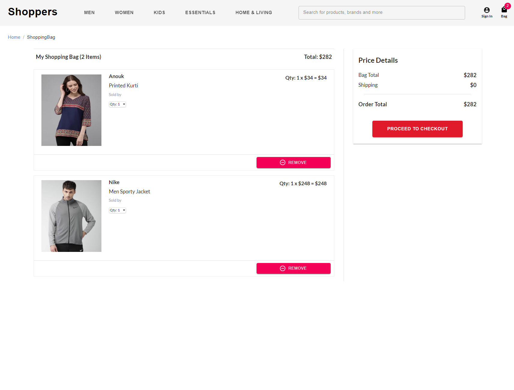

# spring-boot-react-ecommerce-app
eCommerce application based on the microservices architecture built using Spring Boot and ReactJS.

# **Sample Website**

## **Main Page**


## **Cart Page**



## **Mobile Version**
  


 

## **FEATURES**

- Different Authentication options
  - Google OAuth 2.0.
  - UserName Password Authentication
- Search bar and Search suggestions help to find products quickly.
- MySQL database to store user Info
- Redis Cache
- Product and Category Filters.
- Organize products by popularity, the latest arrivals, and price.
- Implement pagination to show a limited number of products per page.
- Store authentication details, such as tokens, in cookies.
- Save cart information in cookies.
- Integrate Stripe's API for processing payments.
- Ensure the website is responsive and works on all devices.
- 
**TOOLS USED**

- **ReactJS:** 
- **Spring Boot 2.0:** Back-end JAVA framework
- **MySQL:** A database for storing product and user information.
- **Redis:** A key-value store for caching API data.
- **Cloudinary:** CDN server.
- **Google OAuth:** Authentication Service. 
- **Stripe:** An API for processing payments.
- **Docker-Compose:** Containerization.
- 
**MICROSERVICES**

- **React-UI Service:** : The front-end client interface that displays data and makes API calls using Axios.
- **Common Data Service:** Manages client requests to provide data such as products, filters, categories, and order information.
- **Authentication Service:**  Manages user account creation and username/password authentication.
- **Payment Service:** Handles payment requests from the client and makes a subsequent request to Stripe API
 for money deduction. 
- **Search Suggestion Service:** Provides search suggestions based on prefixes using a Hashmap, which is created from database data with various combinations and populated accordingly.
**Steps for executing the application using docker-compose:**

Installation Video: https://youtu.be/nPKYbdKPd0E

1. Clone/Download the repository.

2. Set the environmental variables which will be impacted on docker-compose.yml.
   
    1. Rename the file ".env-sample" to ".env".     
    2. (Optional Step) You need to create a Stripe account and Google OAuth credentials.
       The application works even if you don't create this account, only the payment and OAuth functionality will not work.
       These accounts doesn't charge you anything and are absolutely free.<br/><br/>

       You need to set below two env variables.<br/><br/>

       REACT_APP_STRIPE_PUBLISH_KEY=<Your Stripe Publishable Key>

       Go [Here](https://dashboard.stripe.com/register) to create a Stripe account.
       <br/><br/>
       REACT_APP_GOOGLE_AUTH_CLIENT_ID=<Your Google AUTH Client ID>

       Go [Here](https://console.developers.google.com) to create Google OAuth Credentials.

3. Build all the microservices and run the app using docker-compose. This is done using ./start-all.sh script which creates the network and set the container dependencies based on the config mention in the docker-compose.yml. 
   This will build all the jar files and run all the services.
   ```
      ./start-all.sh
   ```

4. If you are making any change in the code then you need to you ./stop-all.sh to clean up the jars created by ./start-all.sh script.

**Payment Service Test Details:**

    Credit card no.: 4242 4242 4242 4242
    Expiry: Any future date
    CVV: Any 3-digit number

**Steps to deploy on Heroku using docker-compose:**

1. create heroku.yml as docker-compose.yml is not invoked on Heroku.

2. If the application contains a database then install MySQL or any other database 
   from Heroku marketplace[https://elements.heroku.com].
   <br/><br/>
   Note: Before installing you need to add credit/debit card info. Without this it 
   won't allow you to install the database.


3. Set the config vars based on the database URL.
    

4. Set the stack:container for the application in order to build with docker-compose.
   ```
      heroku stack:set container -a <application-name>
   ```
 
5. Deploy individual service on Heroku.